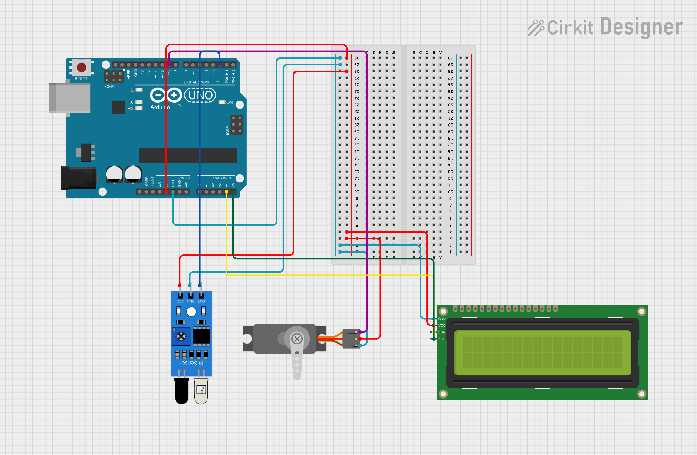

# Sistem Parkir Otomatis dengan Arduino Uno

Proyek ini bertujuan untuk membuat sistem parkir mini otomatis menggunakan Arduino Uno, IR Sensor, Servo Motor, dan LCD I2C 16x2.

## 🧩 Komponen yang Digunakan

- Arduino Uno  
- IR Sensor (Infrared)  
- Servo Motor SG90  
- LCD 16x2 dengan modul I2C  
- Kabel Jumper  
- Breadboard (opsional)

## 📌 Wiring Diagram

### IR Sensor
| Pin         | Terhubung ke   |
|-------------|----------------|
| VCC         | 5V Arduino     |
| GND         | GND Arduino    |
| OUT         | Digital Pin 2  |

### Servo Motor
| Pin         | Terhubung ke   |
|-------------|----------------|
| Brown (GND) | GND Arduino    |
| Red (VCC)   | 5V Arduino     |
| Orange      | PWM Pin 9      |

### LCD I2C 16x2
| Pin         | Terhubung ke   |
|-------------|----------------|
| SDA         | A4 Arduino     |
| SCL         | A5 Arduino     |
| VCC         | 5V Arduino     |
| GND         | GND Arduino    |

> Alamat default I2C LCD adalah `0x27`. Pastikan alamat sesuai atau gunakan I2C scanner jika tidak berjalan.

## 🧠 Konsep Kerja

- Saat tidak ada mobil → Gate tertutup dan LCD menampilkan "Parkir Penuh".
- Jika IR sensor mendeteksi mobil → Gate terbuka dan LCD menampilkan "Silahkan Masuk".
- Setelah beberapa detik, gate menutup kembali secara otomatis.

## 🛠️ Library yang Diperlukan

- `Wire.h`
- `LiquidCrystal_I2C.h`
- `Servo.h`

Library dapat diinstal melalui Library Manager di Arduino IDE.

## 🚀 Pengembangan Lebih Lanjut

- Tambahkan sensor keluar untuk kendaraan
- Gunakan LED indikator untuk status buka/tutup
- Tambahkan buzzer sebagai alarm
- Simpan jumlah kendaraan ke EEPROM

## 📝 Catatan

Pastikan semua koneksi benar dan komponen bekerja sebelum upload kode.

## Circuit Projek
